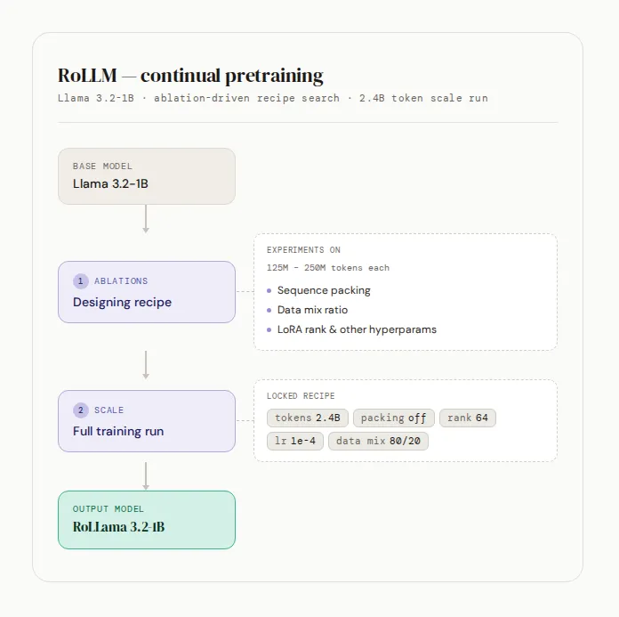
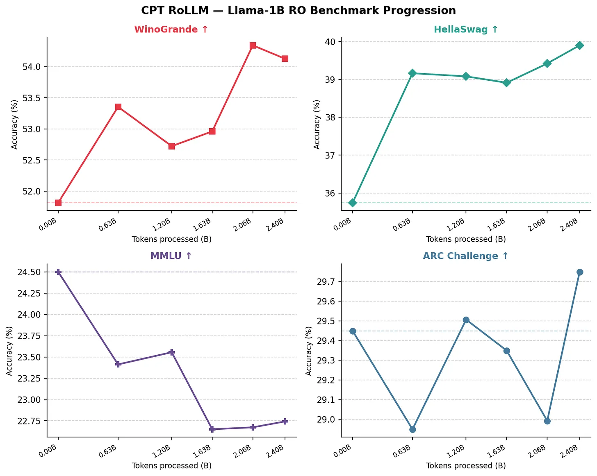

# RoLLM-CPT: Continual Pretraining of Llama-3.2-1B for Romanian

Adapts Llama-3.2-1B to Romanian through continual pretraining (CPT) with QLoRA, using a milestone-based training loop that evaluates Romanian and English signals at token checkpoints. The repo covers both recipe-selection experiments and two full 2.4B-token runs comparing unfiltered Romanian web data against its educational-value-filtered counterpart.

This repo accompanies the Substack post: **[RoLlama3.2-1B : CPT of a Small Language Model](https://dan1180627.substack.com/p/rollama32-1b-cpt-of-a-small-language)** 



---

## Key Findings

| Experiment | Finding |
|---|---|
| Sequence packing | No throughput gain at BS=32 — run is compute-bound, not memory-bound. Higher loss than padding at equal token budget. |
| Data mix | 80% Romanian / 20% English is optimal. 100% Romanian causes measurable English forgetting with no downstream gain. |
| LoRA rank | r=64 is Pareto-optimal over r=128: same loss, 4% faster, less VRAM. r=256 shows instability. |
| Embeddings | Training embed_tokens and lm_head (full, not LoRA) improves Romanian perplexity with no English regression. |
| Full 2.4B runs | Both runs improve Romanian language understanding, with RoHellaSwag and RoWinoGrande gaining up to 10%. The filtered corpus performs better overall, especially on RoARC, while reducing but not eliminating the RoMMLU regression. |



---

## Setup

```bash
pip install -r requirements.txt
```

Create a `.env` file with your HuggingFace token:
```
HF_TOKEN=your_token_here
```

---

## Training

Run a full milestone training loop:

```bash
cd continual_pretrain
python train_milestones.py
```

Key config overrides (Hydra syntax):

```bash
# Change model
python train_milestones.py model.builder.model_name="meta-llama/Llama-3.2-1B"

# Change LoRA rank
python train_milestones.py model.lora.r=64

# Adjust token budget per milestone
python train_milestones.py milestone.tokens_per_milestone=100000000
```

Full config in `continual_pretrain/configs/train_model.yaml`.

---

## Experiments

Each script reproduces one controlled comparison or full-run utility from the post. Run from `continual_pretrain/`:

```bash
cd continual_pretrain
bash scripts/run_packing_comparison.sh
```

| Script | Tests |
|---|---|
| `run_packing_comparison.sh` | Sequence packing vs padding at equal token budget |
| `run_data_mix_eval.sh` | Romanian/English data mix ratios (40/60 → 100/0) |
| `run_lora_rank_sweep.sh` | LoRA rank comparison: r=8, 32, 64, 128, 256 |
| `run_embedding_comparison.sh` | Training embedding layers vs freezing them |
| `run_embedding_lr_sweep.sh` | Embedding LR multiplier sweep (1x, 2x, 5x, 10x base LR) |
| `run_hyperparam_sweep.sh` | Gradient accumulation sweep at fixed effective batch size |
| `run_full_cpt.sh` | Full 2.4B token training run with the locked recipe (swap Romanian corpus to compare unfiltered vs filtered) |


## Evaluation

```bash
cd continual_pretrain
python run_evaluation.py model_path="path/to/merged/model"
```

Uses a custom fork of [lm-evaluation-harness](llm-eval-harness-ro/) with Romanian tasks:
`ro_arc_challenge`, `ro_winogrande`, `ro_belebele`, `ro_mmlu`, `ro_wiki`

---

## Project Structure

```
continual_pretrain/
├── train_milestones.py       # Entry point: milestone training loop
├── run_evaluation.py         # Entry point: benchmark evaluation
├── model.py                  # Model loading + QLoRA setup
├── milestone_trainer.py      # Custom HF Trainer with milestone hooks
├── train_utils.py            # LR scheduling, dataset mixing, checkpointing
├── trainer_callbacks.py      # WandB + evaluation callbacks
├── data_module.py            # Data preprocessing + collators
├── data_processing/          # Dataset formatters and registry
├── configs/                  # Hydra config files
└── scripts/                  # One shell script per experiment
```
